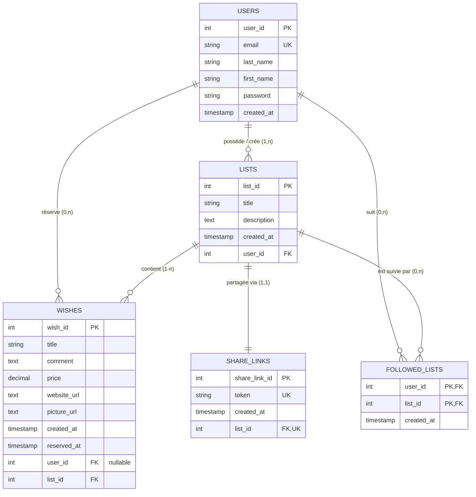
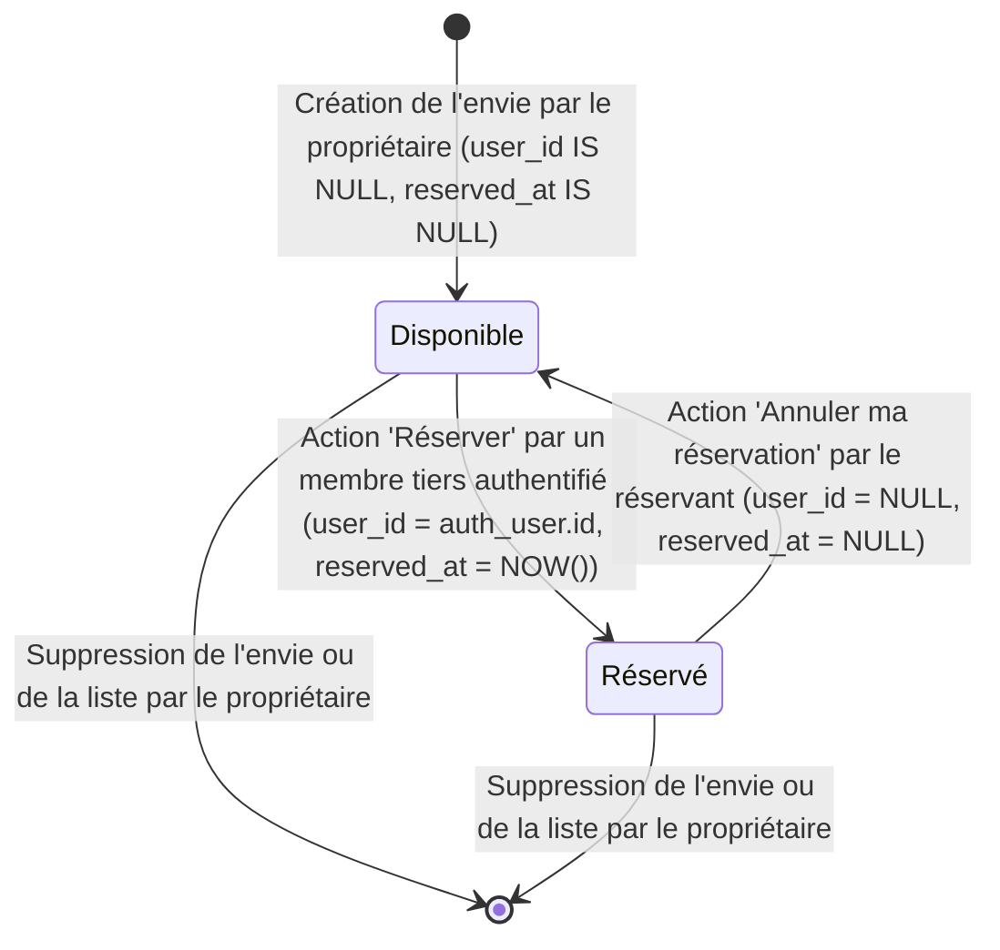

# Dictionnaire de Données & Règles de Gestion — Famylist

Ce document regroupe le **Dictionnaire de Données** technique et fonctionnel ainsi que l'ensemble des **Règles de Gestion Métier (RG)** de l'application **Famylist**.

---

# Sommaire

1. [Présentation Générale & Modèle Conceptuel](#1-présentation-générale--modèle-conceptuel)
2. [Dictionnaire de Données](#2-dictionnaire-de-données)
   - [2.1 Entité USERS (Utilisateurs / Membres)](#21-entité-users-utilisateurs--membres)
   - [2.2 Entité LISTS (Listes de souhaits)](#22-entité-lists-listes-de-souhaits)
   - [2.3 Entité WISHES (Envies de cadeaux)](#23-entité-wishes-envies-de-cadeaux)
   - [2.4 Entité SHARE_LINKS (Liens de partage public)](#24-entité-share_links-liens-de-partage-public)
   - [2.5 Entité FOLLOWED_LISTS (Listes suivies / Favoris)](#25-entité-followed_lists-listes-suivies--favoris)
3. [Cycle de Vie & États des Données](#3-cycle-de-vie--états-des-données)
4. [Règles de Gestion Métier (RG)](#4-règles-de-gestion-métier-rg)
   - [4.1 Authentification & Comptes Utilisateurs (RG-USER)](#41-authentification--comptes-utilisateurs-rg-user)
   - [4.2 Gestion des Listes de Souhaits (RG-LIST)](#42-gestion-des-listes-de-souhaits-rg-list)
   - [4.3 Gestion des Envies / Articles (RG-WISH)](#43-gestion-des-envies--articles-rg-wish)
   - [4.4 Partage & Accès Public (RG-SHARE)](#44-partage--accès-public-rg-share)
   - [4.5 Consultation Publique & Ergonomie (RG-CONSULT)](#45-consultation-publique--ergonomie-rg-consult)
   - [4.6 Réservation de Cadeaux (RG-RESERV)](#46-réservation-de-cadeaux-rg-reserv)
   - [4.7 Annulation de Réservation (RG-CANCEL)](#47-annulation-de-réservation-rg-cancel)
   - [4.8 Suivi de Listes (RG-FOLLOW)](#48-suivi-de-listes-rg-follow)
   - [4.9 Sécurité, Confidentialité & Éco-conception (RG-SEC / RG-ECO)](#49-sécurité-confidentialité--éco-conception-rg-sec--rg-eco)

---

# 1. Présentation Générale & Modèle Conceptuel

L'application **Famylist** repose sur 5 entités relationnelles interconnectées dans PostgreSQL 17 via l'ORM Doctrine (Symfony 7) :

---

# 2. Dictionnaire de Données

### Légende du dictionnaire :

- **PK** : Clé Primaire (_Primary Key_)
- **FK** : Clé Étrangère (_Foreign Key_)
- **UK** : Clé Unique (_Unique Key_)
- **NN** : Non Nul (_NOT NULL_)
- **NULL** : Nullable

---

## 2.1 Entité USERS (Utilisateurs / Membres)

Représente un utilisateur enregistré de la plateforme (créateur de liste et/ou contributeur réservant un cadeau).

| Nom du champ (Code SQL) | Libellé Métier          | Type PostgreSQL | Nullabilité | Valeur par défaut   | Contraintes & Validations                                  | Description & Rôle métier                                           |
| :---------------------- | :---------------------- | :-------------- | :---------- | :------------------ | :--------------------------------------------------------- | :------------------------------------------------------------------ |
| `user_id`               | Identifiant utilisateur | `SERIAL` (INT)  | PK, NN      | Auto-incrément      | Clé primaire                                               | Identifiant technique unique de l'utilisateur.                      |
| `email`                 | Adresse e-mail          | `VARCHAR(255)`  | UK, NN      | -                   | Format email valide (RFC 5322), unicité stricte (`UNIQUE`) | Identifiant de connexion unique. Sert à authentifier l'utilisateur. |
| `last_name`             | Nom de famille          | `VARCHAR(50)`   | NN          | -                   | Max 50 caractères, non vide                                | Nom de famille du membre.                                           |
| `first_name`            | Prénom                  | `VARCHAR(50)`   | NN          | -                   | Max 50 caractères, non vide                                | Prénom du membre utilisé pour personnaliser l'interface.            |
| `password`              | Mot de passe            | `VARCHAR(255)`  | NN          | -                   | Hachage Argon2 (Symfony Security)                          | Empreinte chiffrée du mot de passe. Jamais stocké en clair.         |
| `created_at`            | Date d'inscription      | `TIMESTAMP`     | NN          | `CURRENT_TIMESTAMP` | Horodatage serveur ISO 8601                                | Date et heure de création du compte utilisateur.                    |

---

## 2.2 Entité LISTS (Listes de souhaits)

Représente une liste thématique de souhaits créée par un membre pour un événement (Noël, anniversaire, naissance, etc.).

| Nom du champ (Code SQL) | Libellé Métier           | Type PostgreSQL | Nullabilité | Valeur par défaut   | Contraintes & Validations                    | Description & Rôle métier                                               |
| :---------------------- | :----------------------- | :-------------- | :---------- | :------------------ | :------------------------------------------- | :---------------------------------------------------------------------- |
| `list_id`               | Identifiant de liste     | `SERIAL` (INT)  | PK, NN      | Auto-incrément      | Clé primaire                                 | Identifiant technique unique de la liste.                               |
| `title`                 | Titre de la liste        | `VARCHAR(255)`  | NN          | -                   | Max 255 caractères, non vide                 | Nom donné à la liste (ex: "Noël 2026", "Anniversaire 30 ans").          |
| `description`           | Description / Contexte   | `TEXT`          | NULL        | `NULL`              | Texte libre optionnel                        | Précisions optionnelles sur l'événement ou consignes pour les proches.  |
| `created_at`            | Date de création         | `TIMESTAMP`     | NN          | `CURRENT_TIMESTAMP` | Horodatage serveur ISO 8601                  | Date et heure de création de la liste.                                  |
| `user_id`               | Propriétaire de la liste | `INT`           | FK, NN      | -                   | Référence `users(user_id)` ON DELETE CASCADE | Référence vers le membre créateur et propriétaire exclusif de la liste. |

---

## 2.3 Entité WISHES (Envies de cadeaux)

Représente un article ou une idée de cadeau rattachée à une liste de souhaits, pouvant être réservé par un proche.

| Nom du champ (Code SQL) | Libellé Métier            | Type PostgreSQL | Nullabilité | Valeur par défaut   | Contraintes & Validations                      | Description & Rôle métier                                                                       |
| :---------------------- | :------------------------ | :-------------- | :---------- | :------------------ | :--------------------------------------------- | :---------------------------------------------------------------------------------------------- |
| `wish_id`               | Identifiant de l'envie    | `SERIAL` (INT)  | PK, NN      | Auto-incrément      | Clé primaire                                   | Identifiant technique unique de l'article / envie.                                              |
| `title`                 | Titre de l'envie          | `VARCHAR(255)`  | NN          | -                   | Max 255 caractères, non vide                   | Nom du produit ou de l'idée (saisie manuelle en V1).                                            |
| `comment`               | Commentaire / Précisions  | `TEXT`          | NULL        | `NULL`              | Texte libre optionnel                          | Précisions (taille, pointure, couleur, préférence d'occasion, etc.).                            |
| `price`                 | Prix estimatif (€)        | `DECIMAL(10,2)` | NULL        | `NULL`              | Montant décimal positif (>= 0.00)              | Prix indicatif du cadeau, saisi manuellement en V1.                                             |
| `website_url`           | Lien marchand             | `TEXT`          | NULL        | `NULL`              | URL valide, sanitisation HTML                  | Lien web vers la boutique en ligne pour achat (saisi manuellement en V1 ; scraping auto en V2). |
| `picture_url`           | URL de l'image            | `TEXT`          | NULL        | `NULL`              | URL valide, sanitisation HTML                  | Image illustrative du cadeau (renseignée manuellement en V1).                                   |
| `created_at`            | Date d'ajout              | `TIMESTAMP`     | NN          | `CURRENT_TIMESTAMP` | Horodatage serveur ISO 8601                    | Date et heure de création de l'article dans la liste.                                           |
| `reserved_at`           | Horodatage de réservation | `TIMESTAMP`     | NULL        | `NULL`              | NULL si non réservé, sinon date/heure courante | Enregistre le moment précis où un proche a réservé l'article.                                   |
| `user_id`               | Membre réservant          | `INT`           | FK, NULL    | `NULL`              | Référence `users(user_id)` ON DELETE SET NULL  | Utilisateur ayant réservé ce cadeau. `NULL` si l'article est disponible.                        |
| `list_id`               | Liste parente             | `INT`           | FK, NN      | -                   | Référence `lists(list_id)` ON DELETE CASCADE   | Référence vers la liste à laquelle appartient cette envie.                                      |

---

## 2.4 Entité SHARE_LINKS (Liens de partage public)

Gère le partage public sécurisé d'une liste sans révéler d'identifiant séquentiel prédictible et sans exiger de compte pour la consultation.

| Nom du champ (Code SQL) | Libellé Métier       | Type PostgreSQL | Nullabilité | Valeur par défaut   | Contraintes & Validations                                                                       | Description & Rôle métier                                                                                         |
| :---------------------- | :------------------- | :-------------- | :---------- | :------------------ | :---------------------------------------------------------------------------------------------- | :---------------------------------------------------------------------------------------------------------------- |
| `share_link_id`         | Identifiant du lien  | `SERIAL` (INT)  | PK, NN      | Auto-incrément      | Clé primaire                                                                                    | Identifiant technique unique du lien de partage.                                                                  |
| `token`                 | Jeton d'accès public | `VARCHAR(64)`   | UK, NN      | -                   | Jeton alphanumérique unique (format `share-{hash32}` de 38 car., jusqu'à 64 car. max), `UNIQUE` | Jeton opacifiant l'ID de la liste pour l'URL vitrine publique `/shared/share-...` ou `/api/shared-lists/{token}`. |
| `created_at`            | Date de génération   | `TIMESTAMP`     | NN          | `CURRENT_TIMESTAMP` | Horodatage serveur ISO 8601                                                                     | Date et heure de création du lien de partage.                                                                     |
| `list_id`               | Liste partagée       | `INT`           | FK, UK, NN  | -                   | Référence `lists(list_id)` ON DELETE CASCADE, relation 1:1 (`UNIQUE`)                           | Liste associée au token de partage. Une seule URL active par liste.                                               |

---

## 2.5 Entité FOLLOWED_LISTS (Listes suivies / Favoris)

Table de liaison permettant aux utilisateurs connectés de mémoriser et suivre des listes de proches pour y accéder rapidement depuis leur espace.

| Nom du champ (Code SQL) | Libellé Métier         | Type PostgreSQL | Nullabilité | Valeur par défaut   | Contraintes & Validations                    | Description & Rôle métier                                   |
| :---------------------- | :--------------------- | :-------------- | :---------- | :------------------ | :------------------------------------------- | :---------------------------------------------------------- |
| `user_id`               | Membre abonné          | `INT`           | PK, FK, NN  | -                   | Référence `users(user_id)` ON DELETE CASCADE | Identifiant de l'utilisateur qui suit la liste d'un proche. |
| `list_id`               | Liste suivie           | `INT`           | PK, FK, NN  | -                   | Référence `lists(list_id)` ON DELETE CASCADE | Identifiant de la liste suivie.                             |
| `created_at`            | Date de mise en favori | `TIMESTAMP`     | NN          | `CURRENT_TIMESTAMP` | Horodatage serveur ISO 8601                  | Date et heure d'ajout de la liste aux listes suivies.       |

> **Clé primaire composite :** `(user_id, list_id)` garantit l'impossibilité de suivre deux fois la même liste par le même utilisateur.

---

# 3. Cycle de Vie & États des Données

### État d'une Envie de Cadeau (`wishes`)

Une envie possède deux états logiques déduits de la combinaison de `wishes.user_id` et `wishes.reserved_at` :

| État Métier    | `wishes.user_id` | `wishes.reserved_at` | Affichage Propriétaire                        | Affichage Tiers (Visiteur / Autre membre)                    | Affichage Membre Réservant                                         |
| :------------- | :--------------- | :------------------- | :-------------------------------------------- | :----------------------------------------------------------- | :----------------------------------------------------------------- |
| **Disponible** | `IS NULL`        | `IS NULL`            | Carte normale sans badge                      | Carte normale sans badge + Bouton "Réserver"                 | Carte normale sans badge + Bouton "Réserver"                       |
| **Réservé**    | `IS NOT NULL`    | `IS NOT NULL`        | Carte normale sans badge _(Surprise intacte)_ | Badge **"Réservé"** (Bouton désactivé / masqué, nom anonyme) | Badge **"Réservé par vous"** + Bouton **"Annuler ma réservation"** |

---

# 4. Règles de Gestion Métier (RG)

## 4.1 Authentification & Comptes Utilisateurs (RG-USER)

- **RG-USER-01 (Inscription nominale) :** Tout visiteur peut créer un compte en renseignant obligatoirement son prénom, son nom, une adresse email valide et un mot de passe conforme aux règles de sécurité.
- **RG-USER-02 (Unicité de l'email) :** L'adresse email est strictement unique dans le système. Toute tentative d'inscription avec une adresse déjà présente dans `users.email` est rejetée avec un message explicite sans altérer la base de données.
- **RG-USER-03 (Sécurisation des mots de passe) :** Les mots de passe ne sont jamais stockés en clair. Ils sont obligatoirement hachés via l'algorithme robuste **Argon2** géré par le composant Security de Symfony.
- **RG-USER-04 (Protection des sessions) :** L'authentification utilise des cookies de session munis des indicateurs `HttpOnly` (inaccessible au JavaScript, immunité XSS) et `Secure` (transmission exclusive sous protocole HTTPS).
- **RG-USER-05 (Suppression de compte / Cascade) :** En cas de suppression d'un utilisateur, l'ensemble de ses listes est supprimé en cascade (`ON DELETE CASCADE`). Pour les souhaits qu'il avait réservés sur les listes d'autrui, son identifiant est détaché (`ON DELETE SET NULL`), remettant de facto les cadeaux à disposition.

---

## 4.2 Gestion des Listes de Souhaits (RG-LIST)

- **RG-LIST-01 (Propriété exclusive) :** Toute liste créée est obligatoirement et définitivement rattachée à l'utilisateur connecté (`lists.user_id = auth_user.id`).
- **RG-LIST-02 (Titre obligatoire) :** Une liste doit obligatoirement comporter un titre non vide (`lists.title`), d'une longueur maximale de 255 caractères.
- **RG-LIST-03 (Contrôle d'accès - Modification & Suppression) :** Seul le propriétaire légitime d'une liste (`list.user_id == auth_user.id`, vérifié par le `ListVoter` Symfony) a l'autorisation de modifier ses métadonnées (titre, description) ou de la supprimer.
- **RG-LIST-04 (Suppression en cascade) :** La suppression d'une liste entraîne la suppression atomique et définitive en base de données de l'ensemble de ses souhaits (`wishes`), de son lien de partage (`share_links`) et de toutes ses liaisons de suivi (`followed_lists`).

---

## 4.3 Gestion des Envies / Articles (RG-WISH)

- **RG-WISH-01 (Attribution à une liste) :** Une envie appartient obligatoirement à une seule liste de souhaits (`wishes.list_id` NOT NULL).
- **RG-WISH-02 (Droit d'ajout) :** Seul le propriétaire d'une liste a le droit d'ajouter des envies à celle-ci.
- **RG-WISH-03 (Modes de saisie - Cadrage V1 & V2) :**
  - _En V1 :_ L'ajout d'une envie se fait exclusivement par saisie manuelle via formulaire (titre obligatoire, prix estimatif, commentaire/description, URL marchande directe optionnelle pour guider les proches, URL d'image optionnelle).
  - _En V2 :_ L'extraction automatique des métadonnées (titre, prix, photo) par scraping d'URL sera implémentée ultérieurement afin de préserver la simplicité et la robustesse de la version initiale.
- **RG-WISH-04 (Sanitisation des données saisies) :** Toute donnée textuelle ou URL saisie dans le formulaire d'ajout/modification d'une envie (notamment `website_url` et `picture_url`) est impérativement nettoyée par le composant `HTML Sanitizer` de Symfony avant persistance pour prévenir les failles XSS.
- **RG-WISH-05 (Validité du prix) :** Lorsque le champ `price` est renseigné, sa valeur doit être un nombre décimal supérieur ou égal à zéro (`price >= 0.00`).
- **RG-WISH-06 (Droit de modification et suppression de l'envie) :** Seul le propriétaire de la liste est habilité à modifier ou supprimer une envie de sa liste.

---

## 4.4 Partage & Accès Public (RG-SHARE)

- **RG-SHARE-01 (Génération de jeton sécurisé) :** À la demande de partage, le système génère un jeton d'accès unique et imprévisible au format `share-{hash32}` (38 caractères au total, constitué du préfixe `share-` suivi de 32 caractères hexadécimaux offrant 128 bits d'entropie). Ce jeton est stocké en base de données dans la colonne `share_links.token` dimensionnée en `VARCHAR(64)`.
- **RG-SHARE-02 (Unicité du lien de partage) :** Chaque liste dispose au maximum d'un seul lien de partage actif à un instant T (relation 1:1 stricte via contrainte `UNIQUE` sur `share_links.list_id`).
- **RG-SHARE-03 (Résolution du token) :** L'accès à une liste partagée s'effectue exclusivement par la résolution de son jeton (`GET /api/shared-lists/{token}`). L'ID interne de la liste n'est jamais divulgué dans l'URL publique.
- **RG-SHARE-04 (Validité du lien) :** Si le token est inexistant, corrompu ou révoqué, l'API renvoie un code HTTP 404 (ressource introuvable) sans révéler l'existence éventuelle de données privées.
- **RG-SHARE-05 (Mode de diffusion - Cadrage V1 & Évolution hybride) :** En V1, la diffusion d'une liste s'effectue exclusivement par le partage du lien sécurisé unique généré (`token`). Une version hybride combinant le partage de lien et l'ajout direct de membres par e-mail sera mise en place dans une prochaine version.

---

## 4.5 Consultation Publique & Ergonomie (RG-CONSULT)

- **RG-CONSULT-01 (Consultation libre sans compte) :** Tout visiteur disposant du lien de partage valide peut consulter la vitrine de la liste et l'intégralité de ses souhaits en lecture seule, sans obligation d'inscription préalable.
- **RG-CONSULT-02 (Préservation absolue de la surprise) :** Le propriétaire d'une liste ne doit **jamais** voir l'état de réservation de ses propres cadeaux :
  - Aucun badge "Réservé" n'apparaît sur son interface.
  - Aucun mail ni notification n'est envoyé lors d'une réservation.
  - Les données de réservation (`user_id`, `reserved_at`) sont systématiquement omises du payload JSON lorsqu'il consulte sa propre liste (contexte de sérialisation).
- **RG-CONSULT-03 (Anonymat strict inter-contributeurs) :** Pour les tiers (visiteurs et autres membres connectés), un cadeau réservé affiche uniquement la mention neutre "Réservé". L'identité du réservant n'est jamais exposée aux autres contributeurs.
- **RG-CONSULT-04 (Sobriété d'affichage) :** Un article disponible (non réservé) n'affiche aucun badge superflu afin de préserver une interface épurée. Seuls les articles réservés arborent un badge visuel distinctif.
- **RG-CONSULT-05 (Incitation contextuelle à la connexion) :** Lorsqu'un visiteur non authentifié clique sur "Réserver ce cadeau", une modale l'invite à se connecter ou à créer rapidement un compte, en conservant l'envie ciblée en mémoire pour valider l'action aussitôt après l'authentification.

---

## 4.6 Réservation de Cadeaux (RG-RESERV)

- **RG-RESERV-01 (Authentification obligatoire) :** Toute action de réservation (`POST /api/wishes/{id}/reserve`) exige impérativement un utilisateur connecté avec un rôle valide (`ROLE_USER`). Le mode "réservation invité non connecté" est strictement interdit.
- **RG-RESERV-02 (Disponibilité préalable) :** Une envie ne peut être réservée que si elle est actuellement libre (`wishes.user_id IS NULL` ET `wishes.reserved_at IS NULL`).
- **RG-RESERV-03 (Horodatage et attribution atomique) :** La validation d'une réservation associe de façon atomique l'identifiant du membre connecté (`wishes.user_id = auth_user.id`) et l'horodatage courant du serveur (`wishes.reserved_at = CURRENT_TIMESTAMP`).
- **RG-RESERV-04 (Interdiction d'auto-réservation) :** Un utilisateur ne peut en aucun cas réserver un cadeau sur une liste dont il est lui-même le propriétaire (`wish.list.user_id != auth_user.id`, contrôlé par `WishVoter` -> HTTP 403 Forbidden).
- **RG-RESERV-05 (Gestion de la concurrence / Anti-doublon) :** En cas de tentative de réservation simultanée d'un même cadeau par deux membres, une transaction PostgreSQL avec verrouillage garantit l'atomicité. La seconde transaction est rejetée avec une erreur de conflit (HTTP 409 Conflict) et l'interface actualise immédiatement le statut avec le badge "Réservé".
- **RG-RESERV-06 (Affichage spécifique du réservant) :** L'utilisateur ayant effectué la réservation est le seul à voir le badge personnalisé "Réservé par vous" ainsi que l'action permettant d'annuler son engagement.

---

## 4.7 Annulation de Réservation (RG-CANCEL)

- **RG-CANCEL-01 (Droit strict d'annulation) :** Seul l'utilisateur qui a personnellement réservé l'envie (`wishes.user_id == auth_user.id`, contrôlé par `WishVoter` via `DELETE /api/wishes/{id}/reserve`) a le pouvoir d'annuler cette réservation. Toute tentative par un tiers est rejetée (HTTP 403 Forbidden).
- **RG-CANCEL-02 (Remise en disponibilité atomique) :** L'annulation réinitialise simultanément les champs `wishes.user_id` et `wishes.reserved_at` à `NULL`.
- **RG-CANCEL-03 (Réactivité immédiate) :** Dès l'annulation validée, le badge "Réservé" disparaît instantanément et le bouton d'action "Réserver ce cadeau" redevient accessible à l'ensemble des proches contributeurs.

---

## 4.8 Suivi de Listes (RG-FOLLOW)

- **RG-FOLLOW-01 (Mise en favori pour membre connecté) :** Tout utilisateur authentifié peut ajouter à ses listes suivies (`followed_lists`) une liste partagée consultée via son token.
- **RG-FOLLOW-02 (Unicité de suivi) :** Un utilisateur ne peut suivre qu'une seule fois une même liste (`PRIMARY KEY (user_id, list_id)`).
- **RG-FOLLOW-03 (Désabonnement libre) :** L'utilisateur peut à tout moment retirer une liste de ses listes suivies sans impacter la liste d'origine ni les réservations en cours.

---

## 4.9 Sécurité, Confidentialité & Éco-conception (RG-SEC / RG-ECO)

- **RG-SEC-01 (Cloisonnement des endpoints API) :**
  - Endpoint public de lecture : `GET /api/shared-lists/{token}` (accessible sans token JWT / sans session).
  - Endpoints de mutation : réservés aux utilisateurs authentifiés (`#[IsGranted('ROLE_USER')]`).
  - Endpoints de gestion de liste : contrôlés par `ListVoter` et `WishVoter`.
- **RG-SEC-02 (Protection XSS & CORS) :** Échappement automatique des variables HTML par Vue.js, filtrage strict CORS sur le domaine Frontend autorisé, et assainissement systématique des chaînes externes.
- **RG-ECO-01 (Exclusions V1 / Sobriété fonctionnelle) :**
  - Pas de scraping automatique d'URL en V1 : Évite les requêtes HTTP externes non maîtrisées et les traitements DOM lourds côté serveur (reporté en V2).
  - Pas de transactions bancaires ni de cagnottes (liens marchands directs uniquement).
  - Pas de surveillance de prix en continu (évite le polling récurrent consommateur d'énergie).
  - Pas d'envois d'e-mails en V1 : Tout se passe in-app via le lien de partage unique afin de minimiser l'infrastructure et la consommation d'énergie (une version hybride combinant partage de lien et ajout direct par e-mail sera mise en place dans une prochaine version).
- **RG-ECO-02 (Cycle de vie & purge des données) :** Mise en place d'une tâche planifiée d'arrière-plan (Cron) pour nettoyer les listes obsolètes de longue date et supprimer les images orphelines afin d'optimiser l'espace disque et la base de données.
- **RG-ECO-03 (Optimisation des payloads) :** Utilisation des contextes de sérialisation Symfony pour ne transférer au client que les données indispensables et pagination des listes volumineuses.
